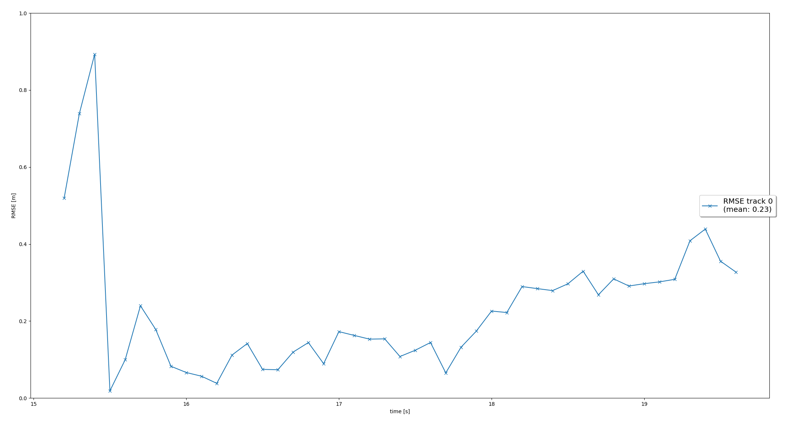
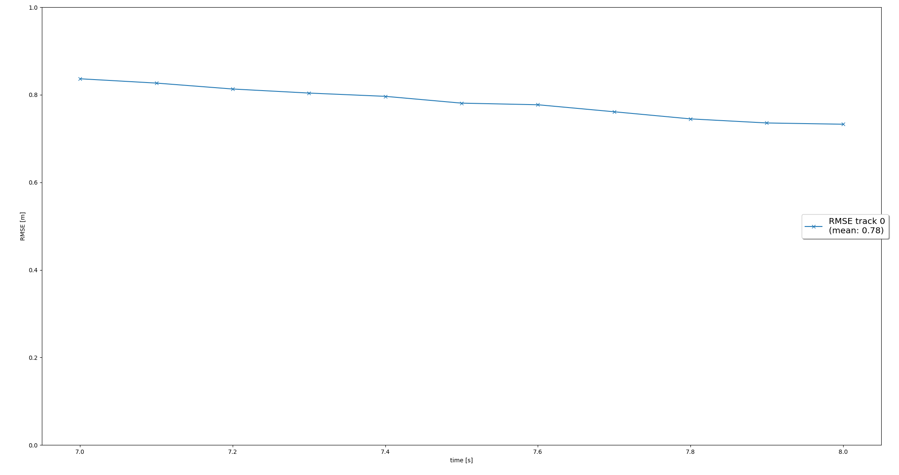
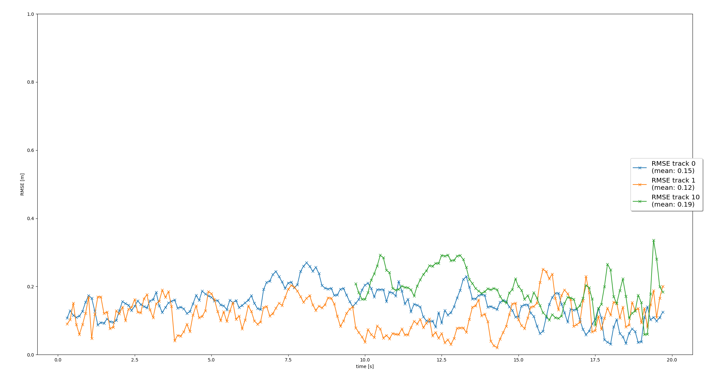

# Writeup

## images

## Question 1
first step was implementing the extended kalman filter. The kalman filter can counteract noise and lead to better predictions.
The filter consists out of a cycle of updates and predictions. We use current information to make predictions and use new measurements to improve.

The next step was the track management where we keep track of all the tracks and update their scores based on the gained information. We adjust the track score based on the visibility. If a certain threshold is reached, we confirm a track. At the same time the tracks can be removed if their score drops to low.

Another step was the data association. We calculate the MHD between all tracks and measurements and matched the best pairs with each other.

In the end we implemented a non-linear camera measurement model and checked if a measurement was in the field of view. The video was to large is found at https://drive.google.com/file/d/1NstYC6wdmlaG0EfCc9Ih2Tc-D5MPCDOi/view?usp=sharing.

## Question 2
By incorporating the camera information as well as camera data we can make better predictions as we can benefit of both types of data. 
Furthermore, the model is less affected by noise in either of the sensors, which results in less ghost tracks. Camera data also contains information that LIDAR simply can't provide such as context.

## Question 3
The actual calibration of the sensor takes a huge effort, which was not relevant within this project. Additionally, an ego motion correction of LIDAR and image data is often needed. The data in this project was already "ready-to-go".

## Question 4
We could improve the model by tuning the hyperparameters and thresholds, but we could also use different network architectures.