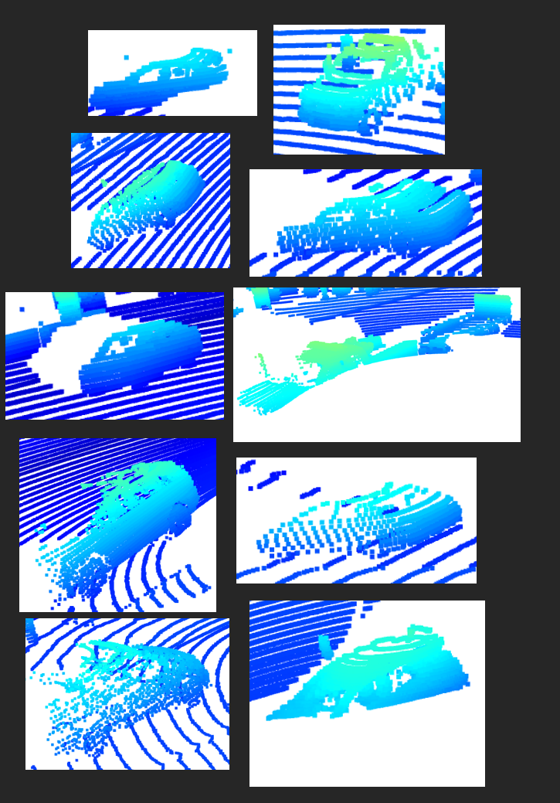
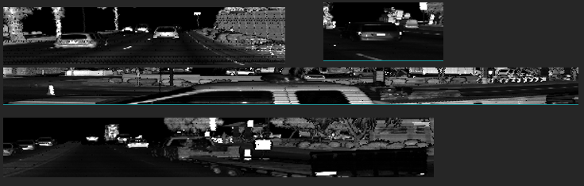
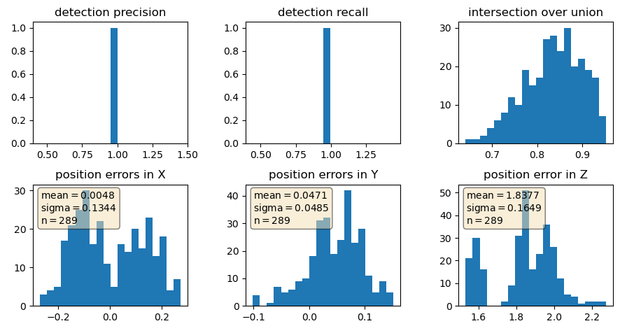
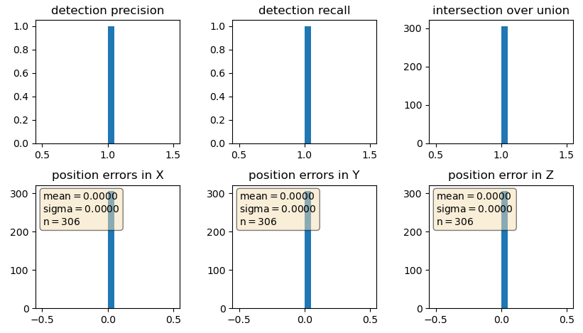

# Writeup:

# point-cloud 10 examples

# stable features

In all views the windows are clearly visible. As they reflect little light, they appear black in the images. Besides that, the tail-lights and the license plate stand out due to their bright appearance in the intensity image. From the side you can see the wheels clearly, due the contrast of materials between tires and wheels.

# image performance

# image GT performance
